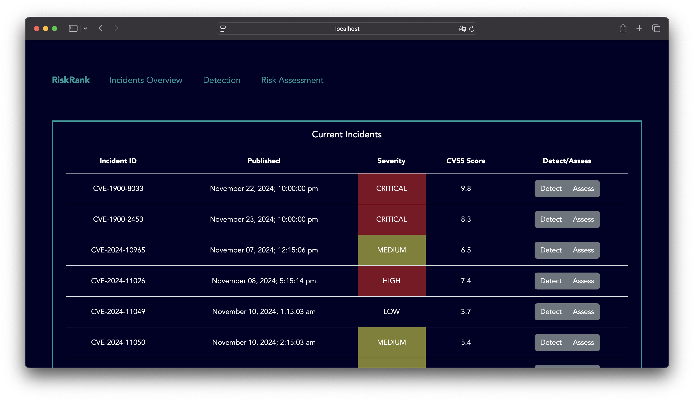

# RiskRank

## **What it does**
**RiskRank** is a web-based platform that centralizes and clearly displays all relevant information about a CVE or incident.



## Getting Started

Follow these steps to set up and run the application locally.

1.Start Frontend
1.1 Install dependencies
```bash
    npm install --force
```
1.2. build the project
```bash
    npm run build
```
1.3. Start the project
```bash
    npm run dev
```
2. Start Backend
```bash
  python run.py
```


